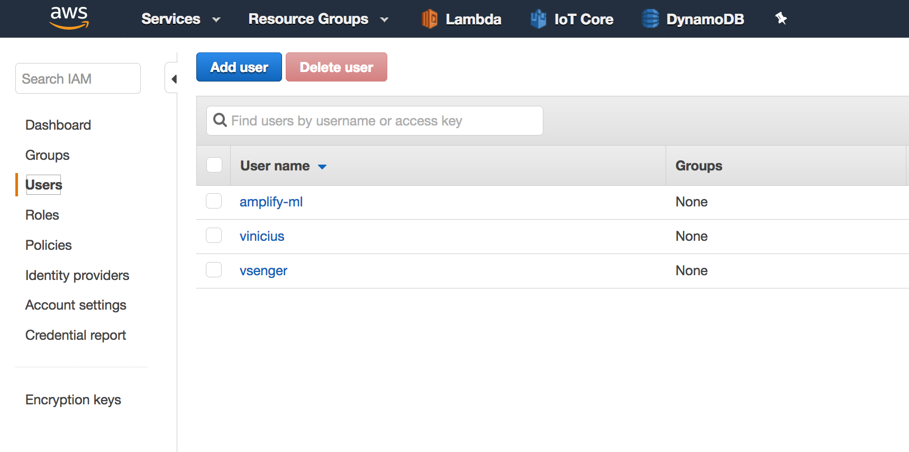
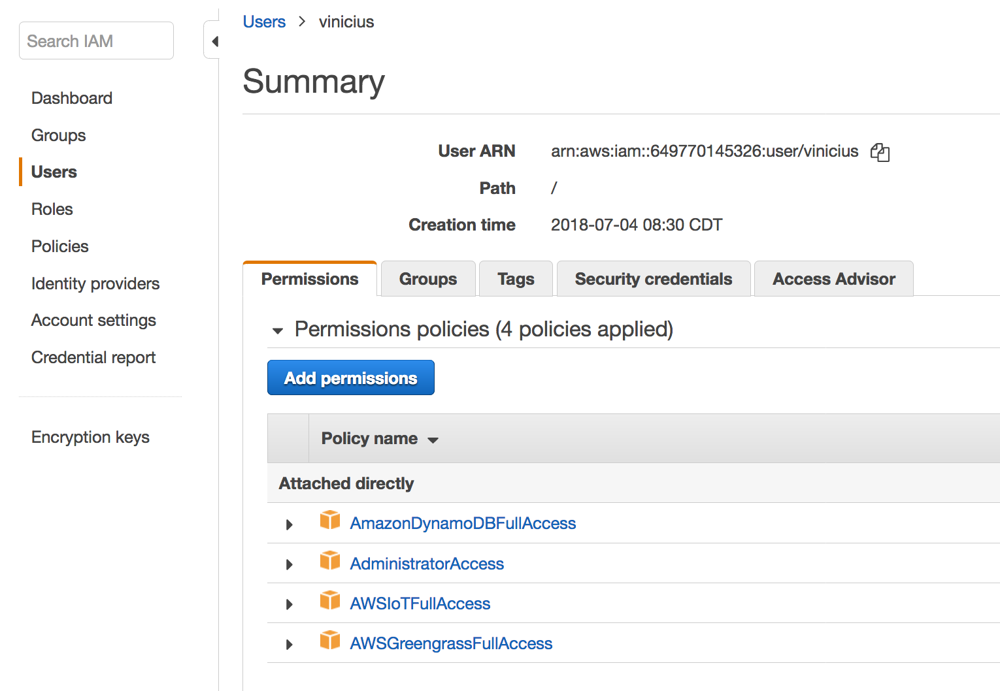

# AWS Serverless Workshop based on 10 real examples

## Setup

### 1. AWS Account Permissions
* Open your IAM AWS Console:

 

### 1.1 Select your user and make sure to add (and also remove in the of the workshop!) these permissions:

 

### [2. AWS CLI](https://docs.aws.amazon.com/cli/latest/userguide/cli-chap-configure.html)
### [3. NodeJS](https://nodejs.org/en/download/)
### [4. Serverless Framework](https://serverless.com/)
### [5. node-red optional](https://nodered.org/docs/getting-started/installation)
* npm install node-red-contrib-aws
