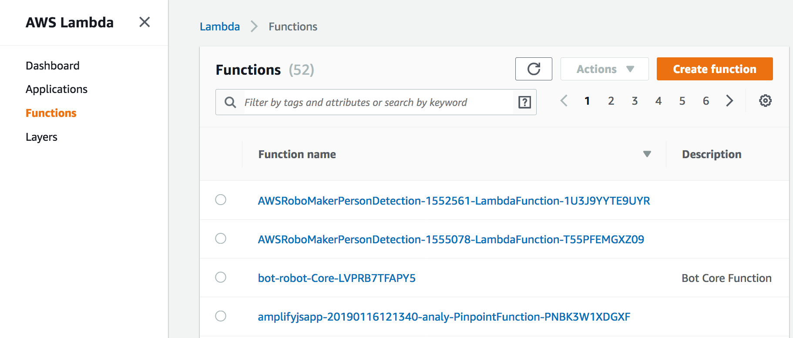
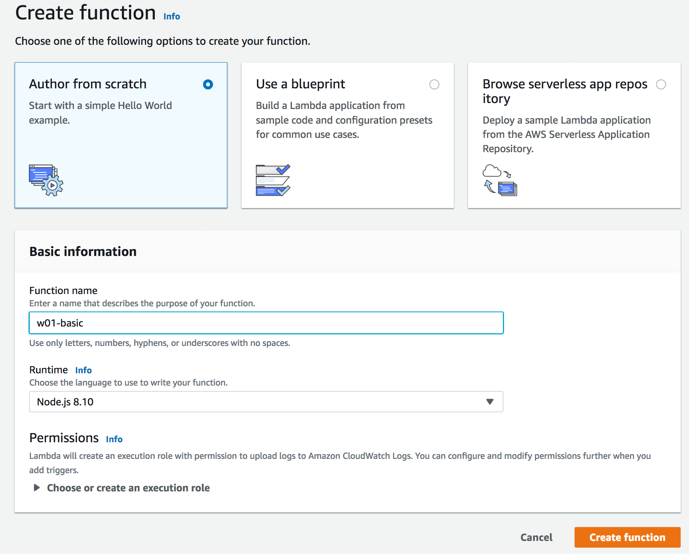
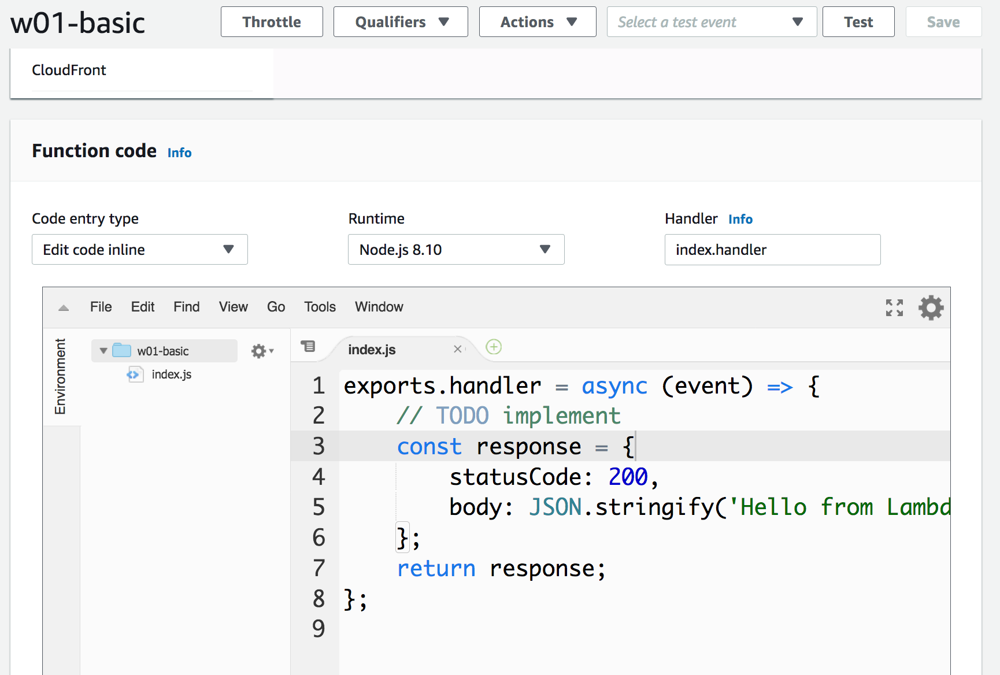
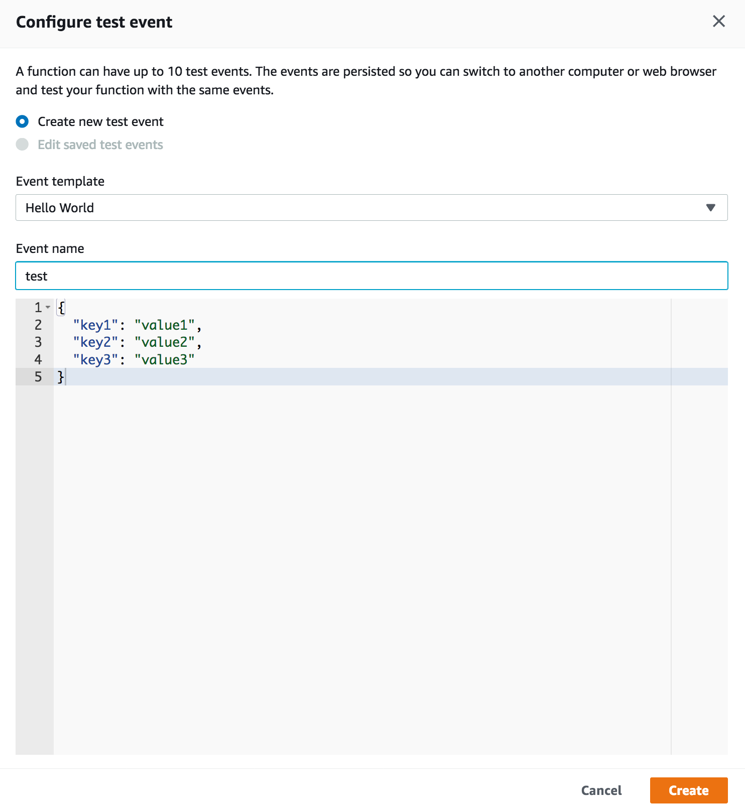
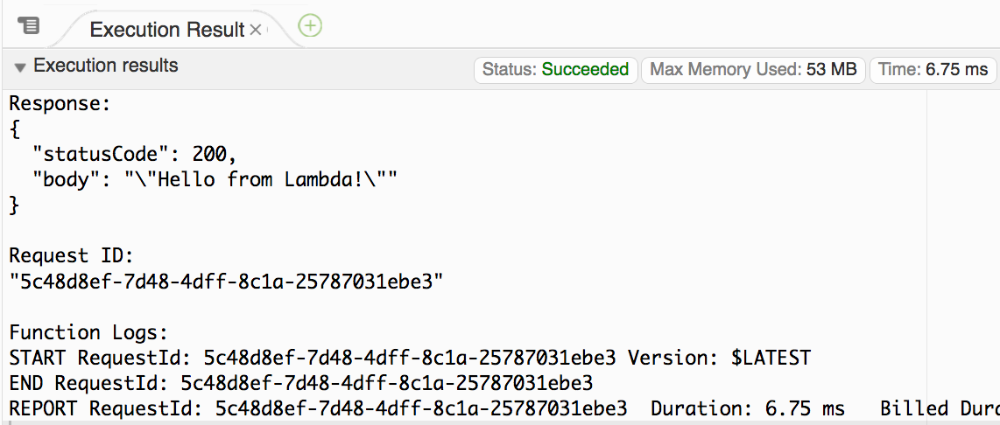
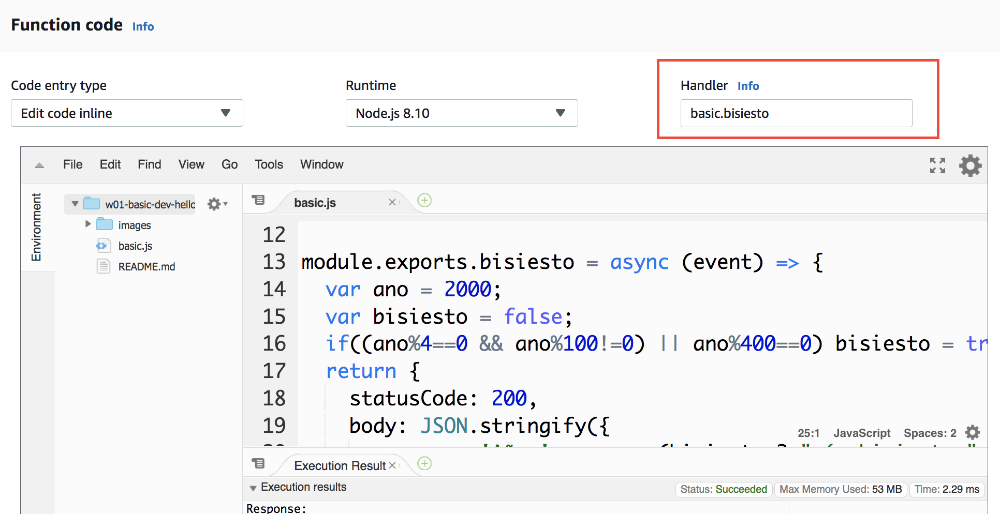
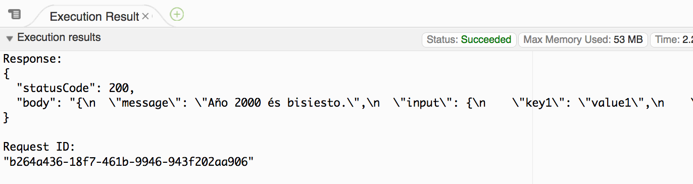

# Example 01 - Basic Programming with NodeJS

To start our workshop we prepared some examples with basic sintax and NodeJS programming model. Login to AWS Lambda Console and let's start to create our first Lambda function to validate our enviroment:

### 1. Open your Lambda console and click "Create Function"

 

### 2. Name your function ex. w01-basic

 

### 3. You should see the following sample code. Let's run this code by clicking on "Test"

 

### 4. It will ask you to configure a set of parameters to execute your program. At this point we don't need to set anything, so let's keep the standard by naming it as "test1" clicking "Create".

 

### 5. Click "Test" again and then you should see the following output

 

### 6. Now let's see a leap year example. Check the code bisiesto and to run it change the Handler Field to "<isindex></isindex>.bisiesto".

 

### 7. The default leap year output should be:

 
