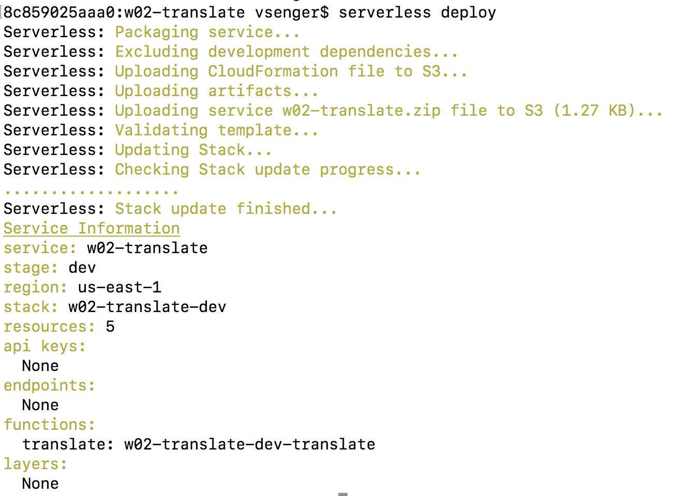

# Example 02 - Creating your own translator based on Amazon Translate

Now let's go straight to the functionality by creating our own translator but... Before we go ahead let's do AWS Lambdas in a much better way: using the Serverless open-source framework!

PS. If you didn't follow the setup instructions to install Serverless Framework, here is the link: 

Serverless Framework allows you to write Lambda code in your computer and then deploy it to AWS Cloud like a boss. Let's start using by download all the workshop examples here: https://github.com/InternetOfHealthcare/serverless-workshop/archive/master.zip

Unzip this file and then you will see one directory for each example, let's jump into the number two:

#### cd w02-translate
#### serverless deploy

 
