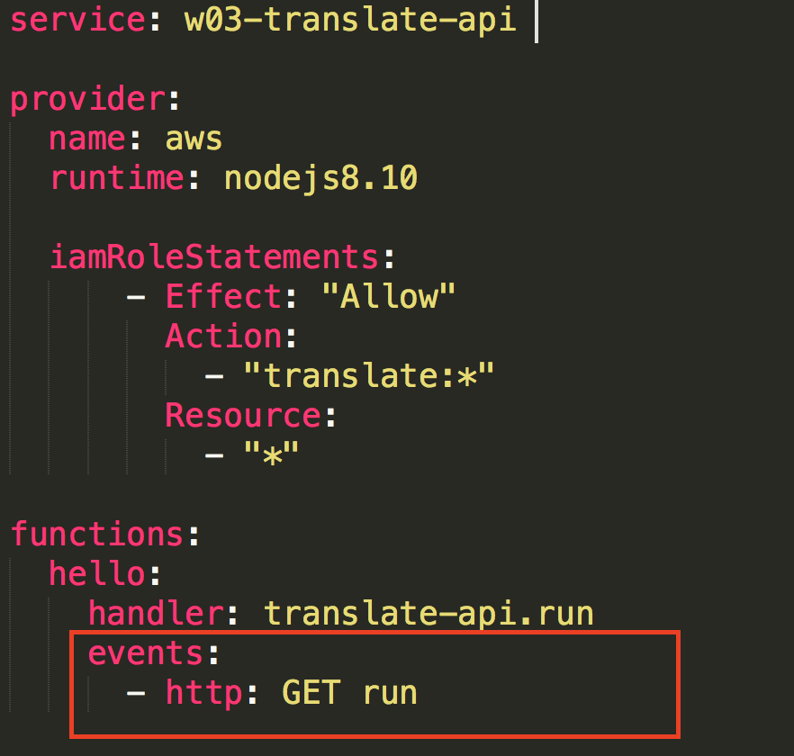
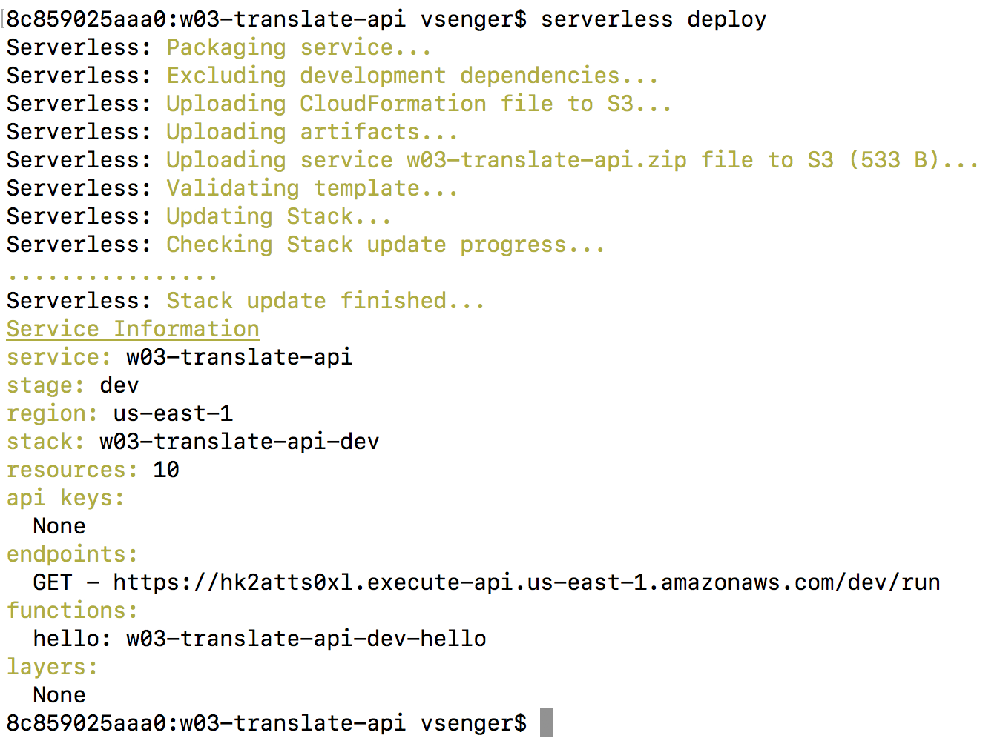
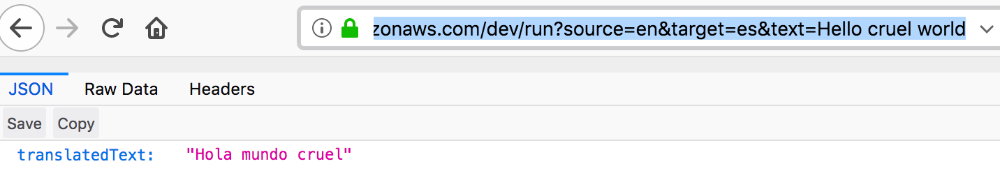

# Example 03 - Addding an API to your Translator with API-Gateway

Now let's give access to our translation service throught the Internet / HTTP. To add API Gateway service to our Lambda we just added a simple configuration instruction in our serverless.yml:

 

Now let's start using the service, type the following commands to deploy it:

* cd w03-translate
* serverless deploy

### 1. Type "serverless deploy" to deploy your local code to AWS Cloud

 

### 2. Copy the endpoint address and add ?source=en&target=rs&text=Translate this

 

### 3. You can change the source and target language, check all the availble language translation services here: https://console.aws.amazon.com/translate/home?region=us-east-1#translation

