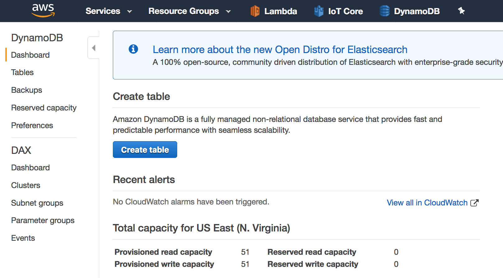
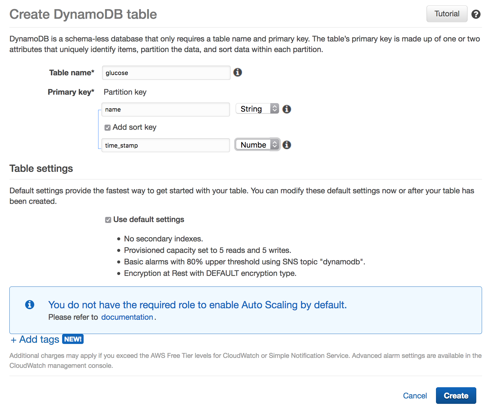
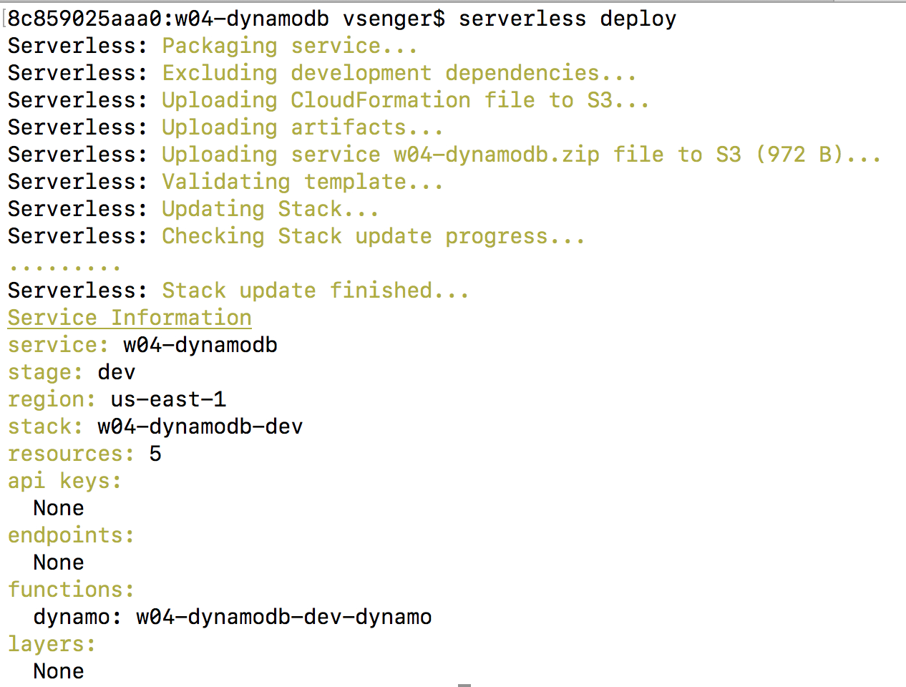
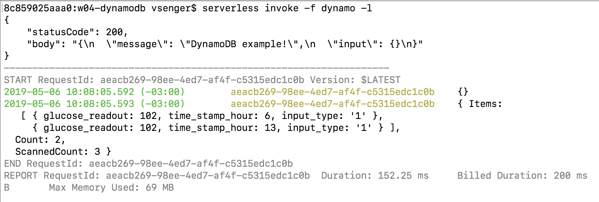

# Example 04 - Serverless Database with DynamoDB

DynamoDB is a no-SQL serverless database very popular at AWS. Let's start using it to store some data. 

### 1. Open the DynamoDB console and click "Create table":

 

### 2. Table name: "glucose", Partition key "name" type "string", Add Sort key "time_stamp" type "number"

 

### 3. Now let's deploy the NodeJS Lambda code:

* cd w04-dynamodb
* serverless deploy

 

### 4. Let's run the code to add new records and read the existing ones

* serverless invoke -f dynamodb -l

 
