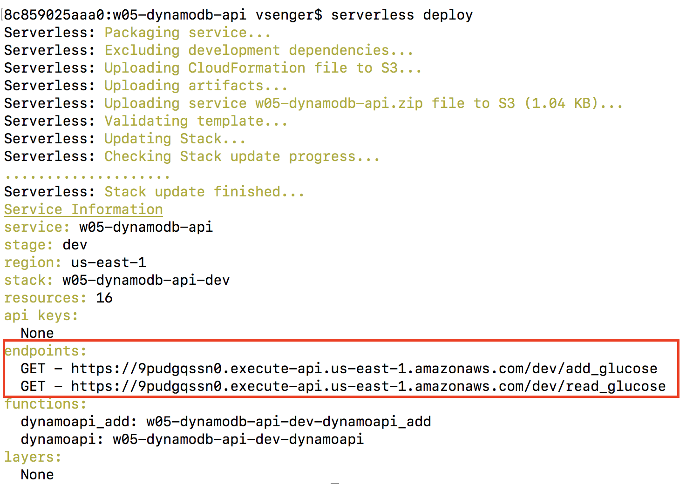
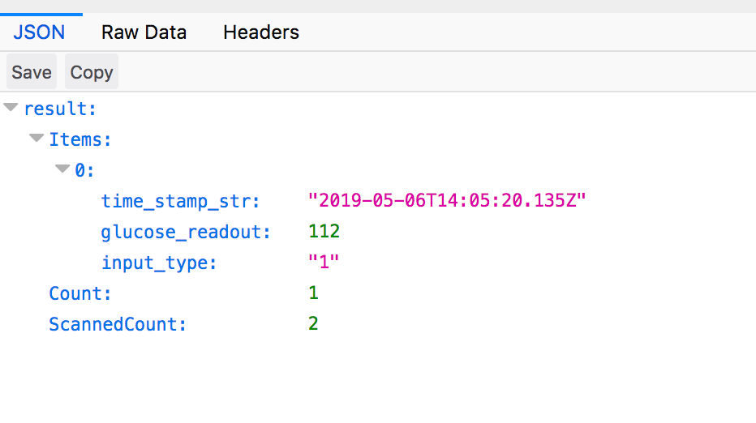

# Example 05 - Serverless Database with DynamoDB + API Gateway

Now we are doing the same we did with our translation service but now with DynamoDB.   

### 1. Let's deploy the example:

* cd w05-dynamodb-api
* serverless deploy

 

### 2. You will see two endpoints, open yuor browser and use it to read the data: 

* http://YOUR READ ENDPOINT?name=Francisco Xavier
* Ex.: https://9pudgqssn0.execute-api.us-east-1.amazonaws.com/dev/read_glucose?name=Francisco Xavier

 

### 3. To add new glucose data use the add_glucose endpoint:

* http://YOUR READ ENDPOINT?name=Francisco Xavier&glucose=95
* Ex.: https://9pudgqssn0.execute-api.us-east-1.amazonaws.com/dev/add_glucose?name=Francisco Xavier&glucose=95

