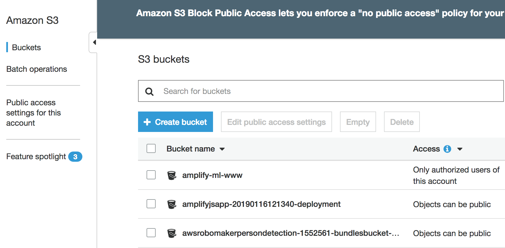
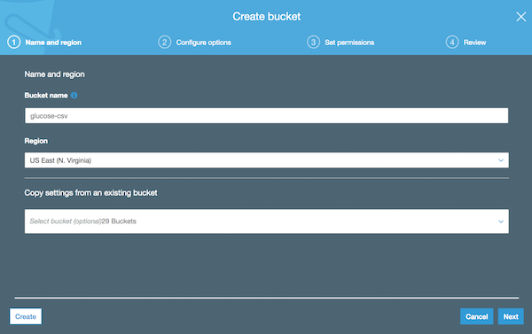

# Example 06 - S3 storage to DynamoDB

S3 is our famous file storage. This example we will upload a CSV file to your S3 and then run a Lambda function that will read the file and add records to your glucose table.

This CSV is a real file imported from Freestyle Libre:

 

### 1. Let's deploy the example:

* cd w05-dynamodb-api
* serverless deploy

 

### 2. You will see two endpoints, open yuor browser and use it to read the data: 

* http://YOUR-READ-ENDPOINT?name=<NAME>
* Ex.: https://9pudgqssn0.execute-api.us-east-1.amazonaws.com/dev/read_glucose?name=Francisco Xavier

 

### 3. To add new glucose data use the add_glucose endpoint:

* http://YOUR-ADD-ENDPOINT?name=Francisco Xavier&glucose=95
* Ex.: https://9pudgqssn0.execute-api.us-east-1.amazonaws.com/dev/add_glucose?name=Francisco Xavier&glucose=95

### IMPORTANT NOTE: usually a REST API will use GET, PUT, DELETE and other HTTP methods to represent the actions. We are using HTTP GET just for convinience to test it.

