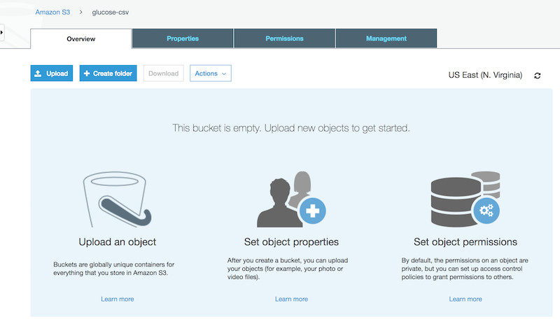
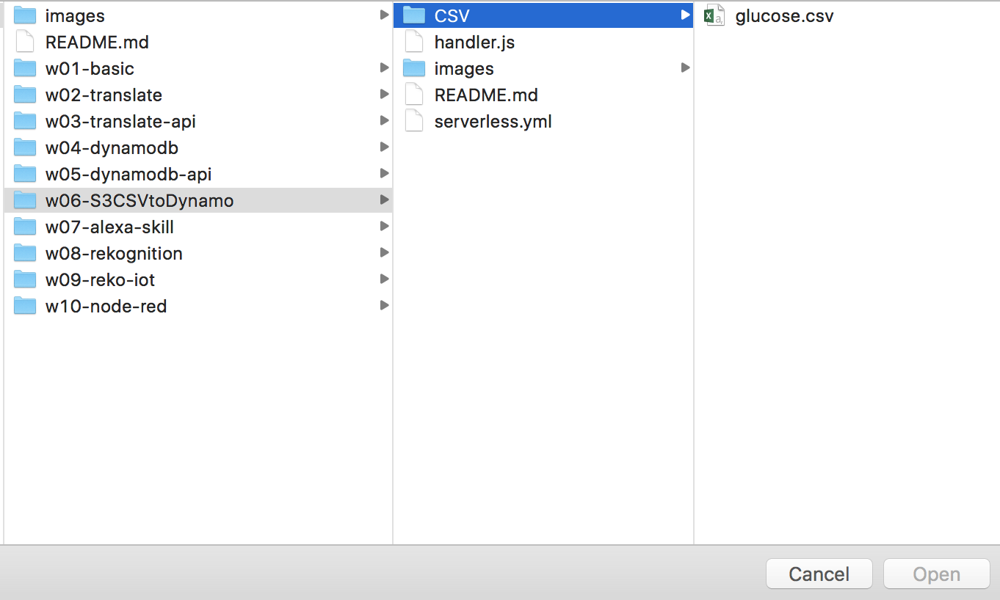
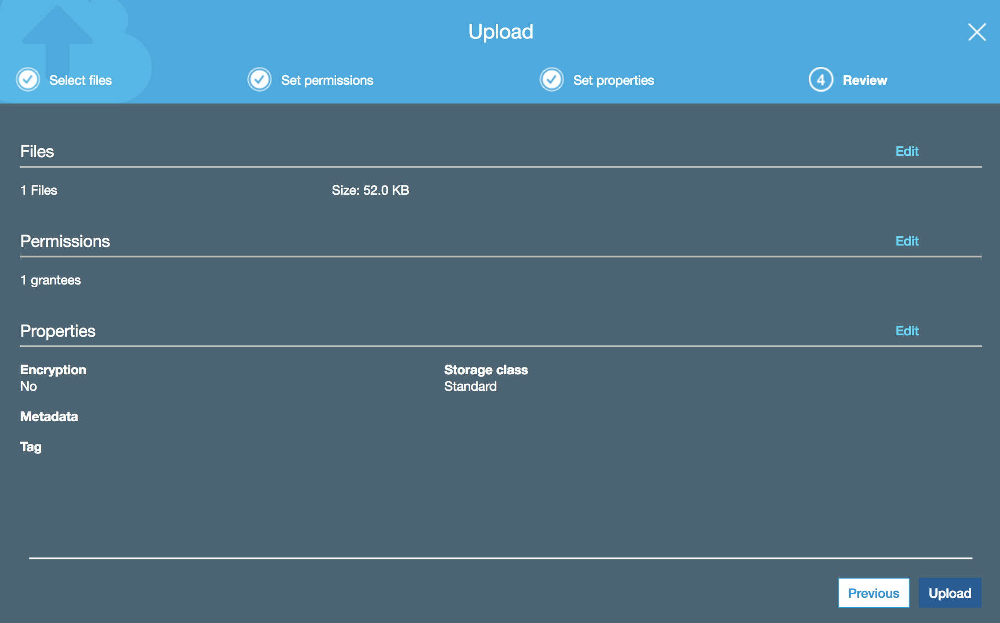
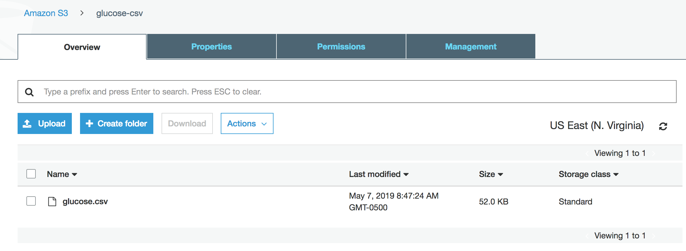

# Example 06 - S3 storage to DynamoDB

S3 is our famous file storage. This example we will upload a CSV file to your S3 and then run a Lambda function that will read the file and add records to your glucose table.

This CSV is a real file imported from Freestyle Libre:

 

### 1. Open your S3 console and click "Create bucket". Bucket is a S3 "directory":

 

### 2. Give a name to your bucket:

 

### 3. Click next until you find "Create bucket"

 

### 4. Now let's upload our file clicking "Upload" 

 

### 5. Click "Add Files" 
 

### 6. Select the file /w06-S3CSVtoDynamo/CSV/glucose.csv

 

### 7. Click next

 

### 8. Click upload
 

### 9. You should have this screen as a result:

 

