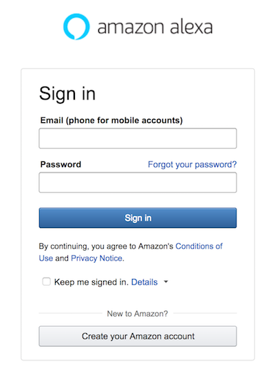
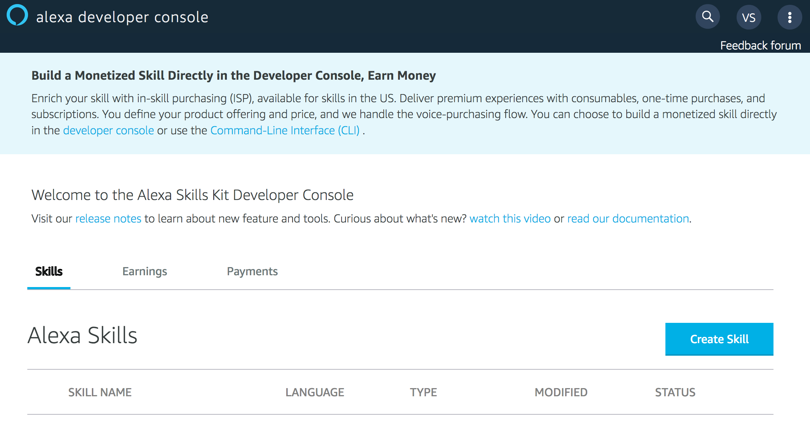
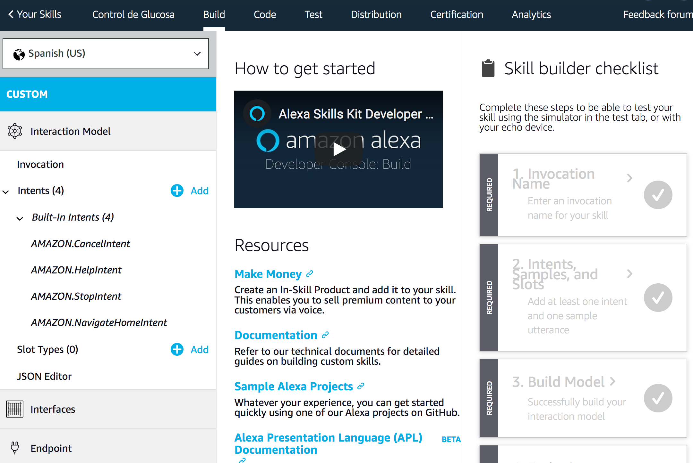

# Example 07 - Alexa Skill for Glucose Database

Now let's have some fun doing an Alexa Skill to interact with your glucose data.

### 1. Go to developer.amazon.com 

 

### 2. Click Login, create a new login if you don't have Amazon Developer account. This account is different from AWS account!

 

### 3. Click "Your Alexa Consoles", "Skills"

 

### 4. Click "Create Skill"

 

### 5. Name your skill and choose the language 

 

### 6. Now we are ready to start the skill development!

 
