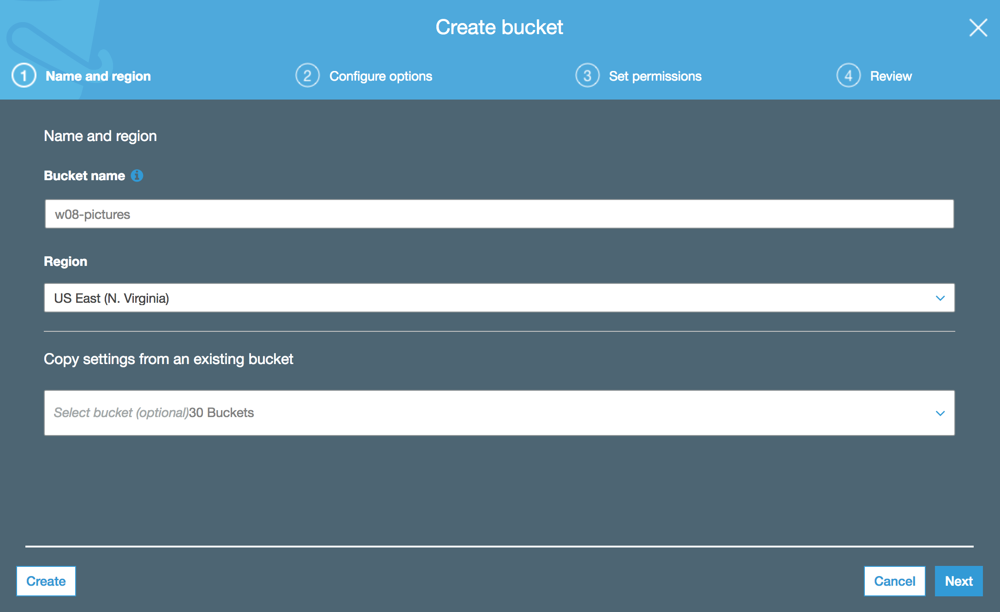
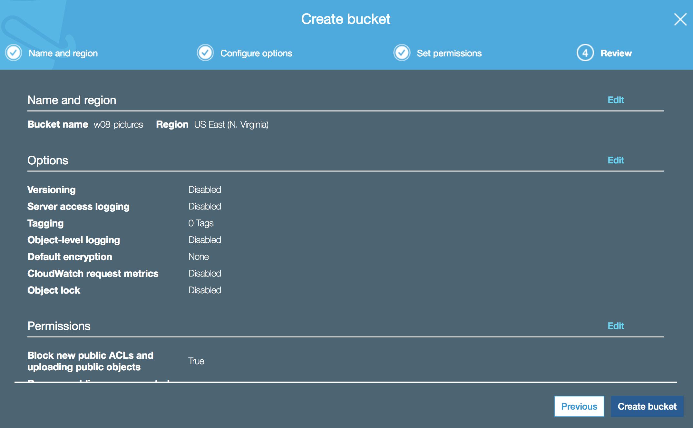
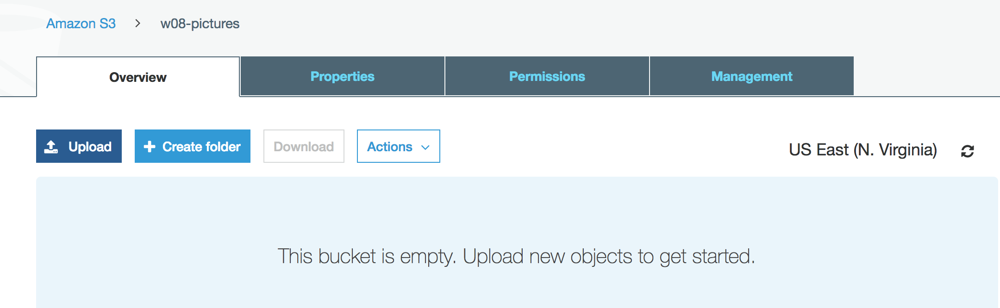
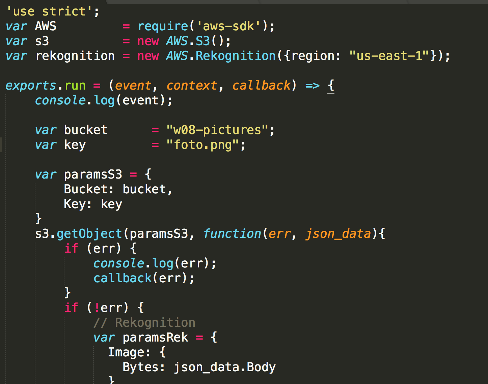
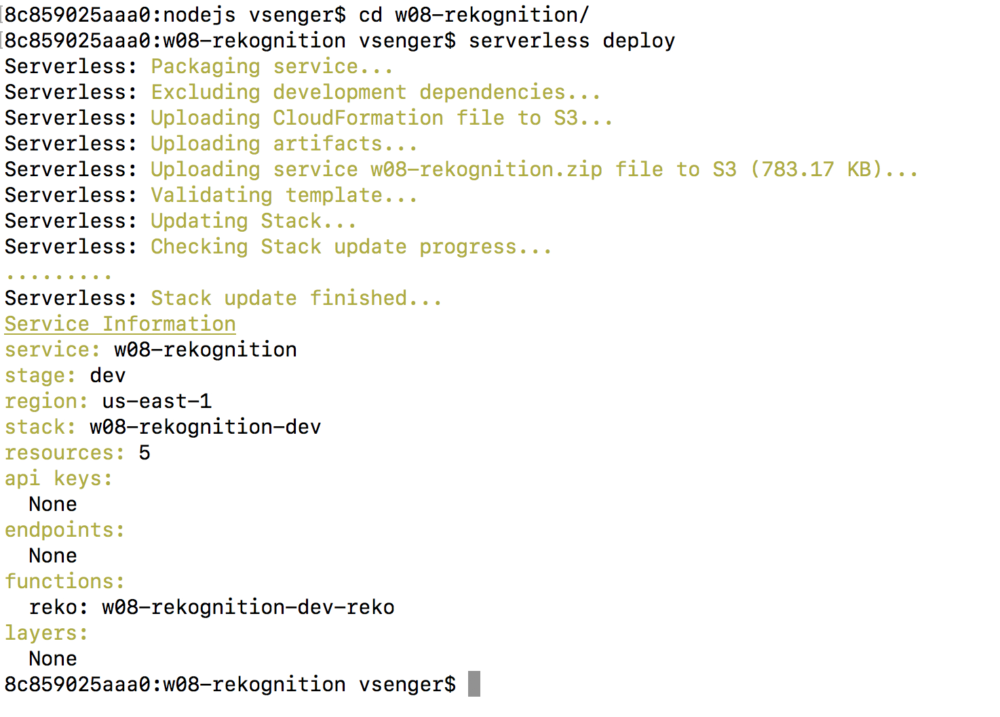
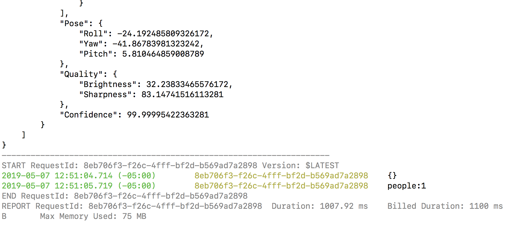

# Example 08 - Rekognition

Rekognition is a service that can use Artificial Intelligence to analyze people, objects, scenes, faces, expressions etc. This example we will upload a picture to our S3 and then run the Lambda to analyze the picture and return the number of people we have in the photo.

### 1. Open your S3 and create a bucket with a picture

 

### 2. Create the bucket w08-pictures 

 

### 3. Click next until you find "Create bucket" button and click it: 

 

### 4. Now upload any picture with one or more person: 

 

### 5. Open the handler.js file and configure the right bucket and filename:

 

### 6. Now let's deploy the Lambda and run the code:

* cd w08-rekognition
* serverless deploy

 

### 7. Let's run the code:

* cd w08-rekognition
* serverless invoke -f reko -l

 

### 8. You should see a JSON with many picture details!
