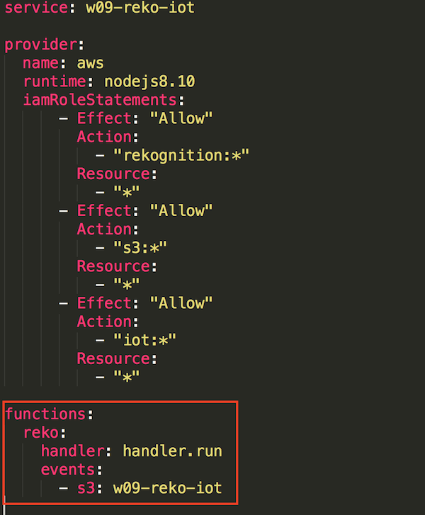
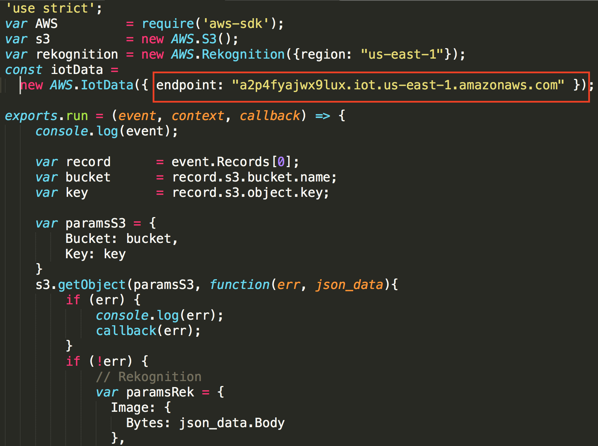
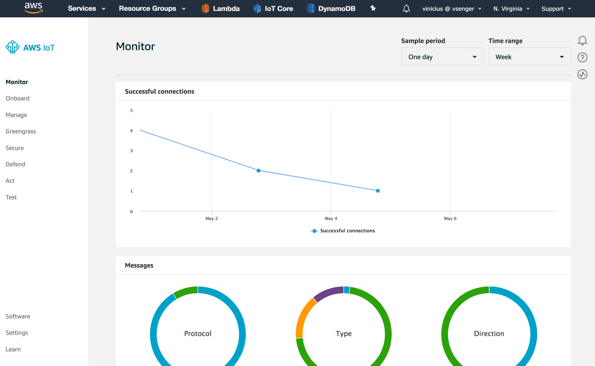
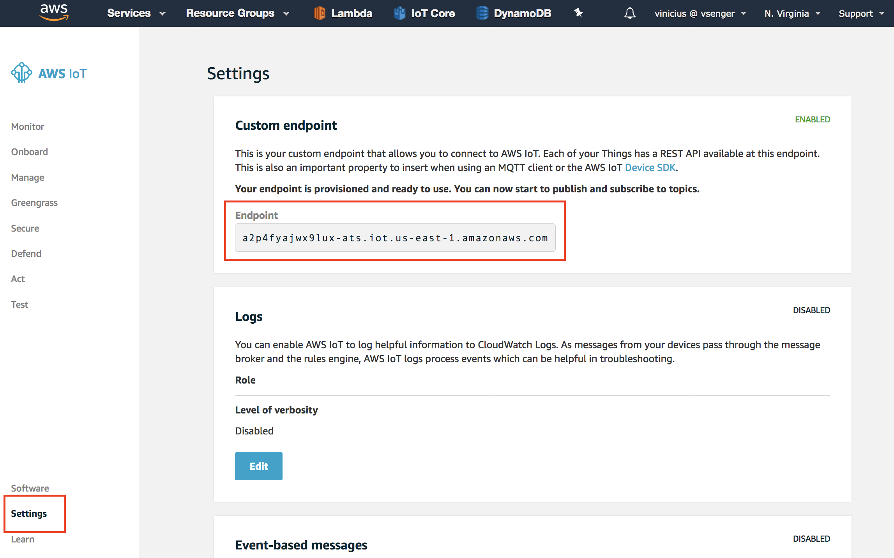

# Example 09 - Lambda + Rekognition + S3 + IoT

Now we will have a more sophisticated architecture integrating S3, Rekognition and IoT. We will configure our S3 bucket to automatically trigger a Lambda function when a new picture is uploaded. This Lambda function will use Rekognition to count people inside the picture and then will be sending an IoT message (MQTT message) to notify the number of people.

### 1. We can see at our serverless.yml config file that we are attaching our Lambda function to a S3 bucket. Every time we have a new file into the bucket w09-reko-iot this Lambda will be triggered:

 

### 2. To send IoT / MQTT message we need to update our handler.js with the right IoT endpoit:

 

### 3. To find your IoT endpoint open IoT Core Console:

 

### 4. Click "Settings" a copy the address:

 

